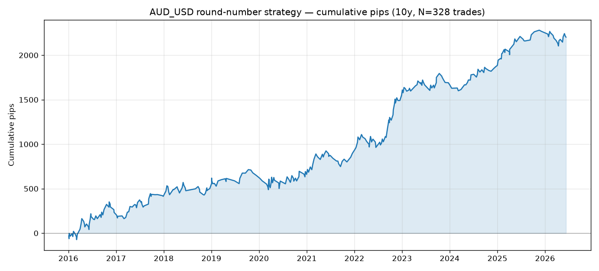
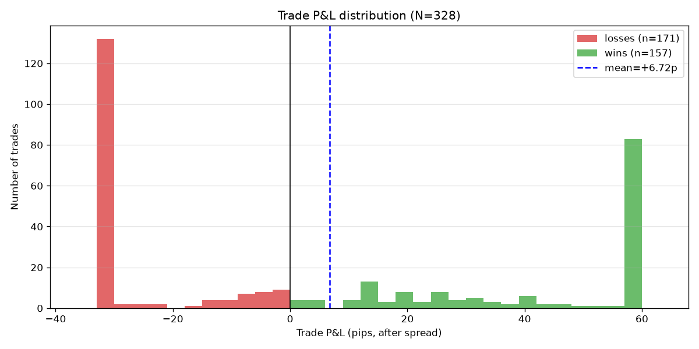
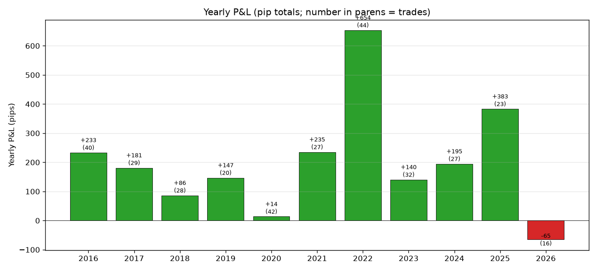
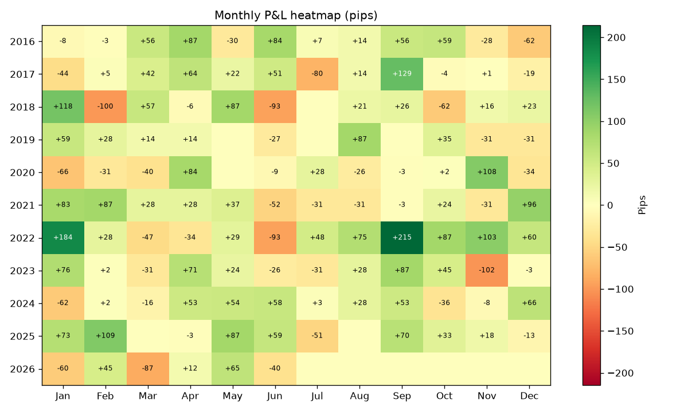
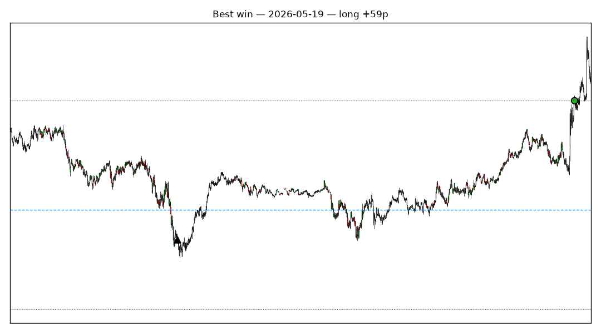
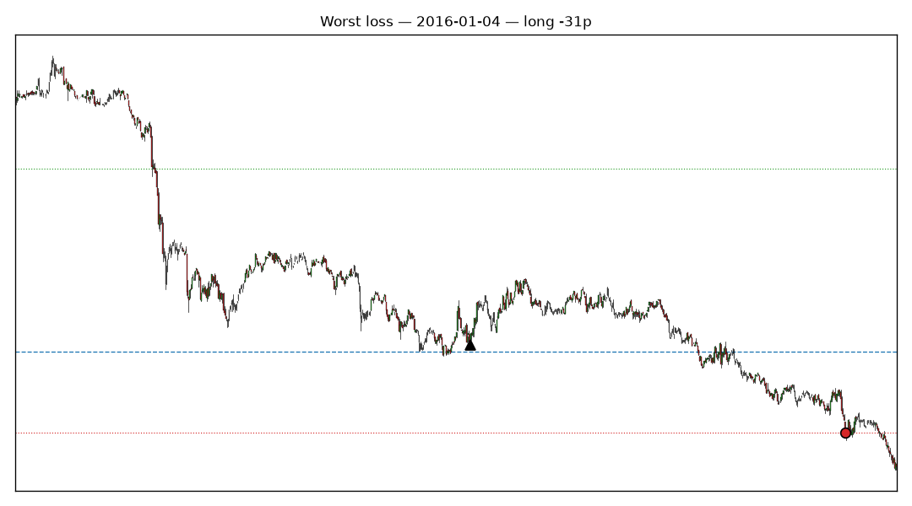
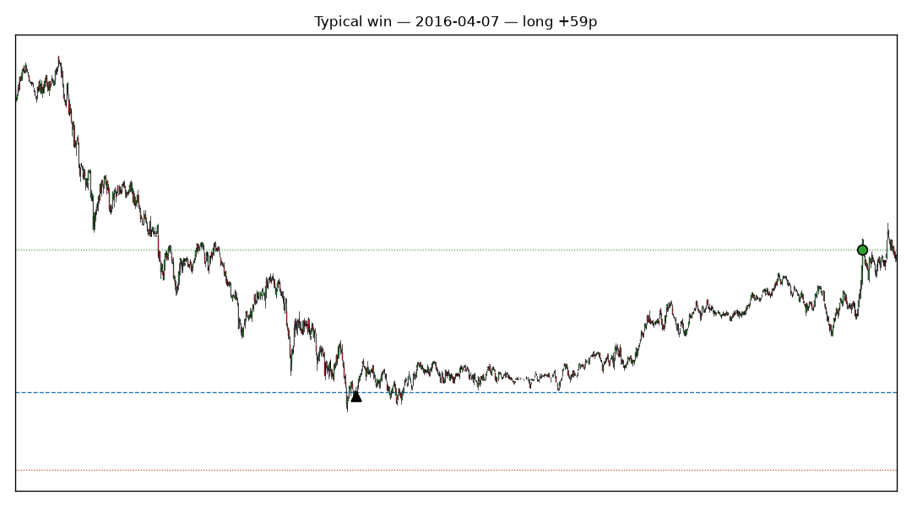
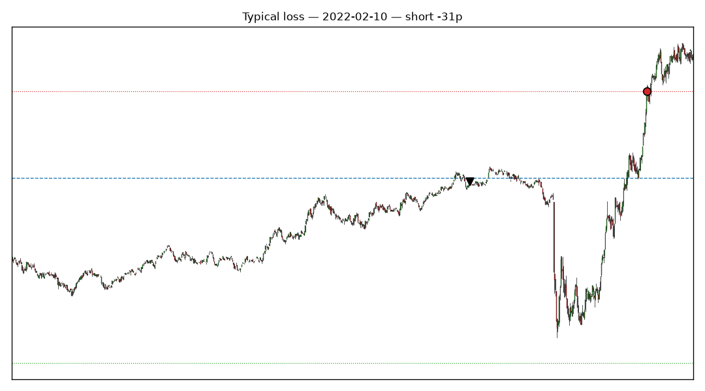
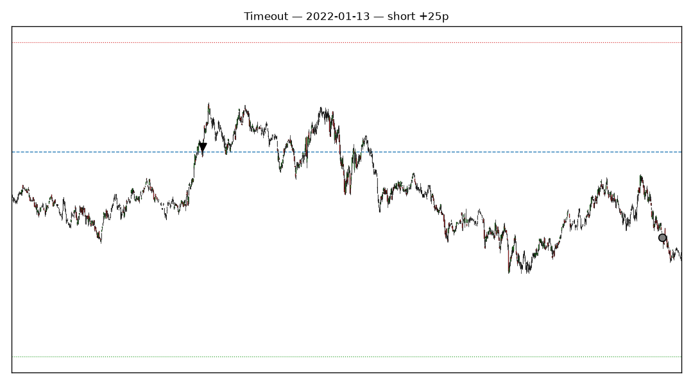

# AUD_USD round-number bounce strategy

*Report generated 2026-07-09 — 10-year backtest, M1 data, spread + limit entries applied.*

## Strategy definition

| Component     | Setting                                                           |
|---------------|-------------------------------------------------------------------|
| Instrument    | AUD_USD (Oanda mid-price bars)                                    |
| Signal        | Touch of a 100-pip round level (every 0.01 grid), first in 5 days |
| Direction     | Up-touch → short (reject down), down-touch → long (bounce up)     |
| Entry timing  | Wait for confirm bar close + 14 more M1 bars (15-min total wait)  |
| Entry order   | **Limit at 2 pips FAVORABLE to signal price** (buy dips / sell rallies) |
| Fill window   | Limit canceled if unfilled within 60 M1 bars (1 hour)             |
| Target        | +60 pips from fill price                                          |
| Stop          | −30 pips from fill price (2:1 reward:risk)                        |
| Time exit     | Close at market after 1440 M1 bars (24h) if neither hit           |
| Spread cost   | **1.0 pip round-trip** deducted from every trade                  |
| Path handling | Worst-case: single bar containing both target and stop → stop wins|

## Headline numbers (10 years, 2016-01 → 2026-07)

- **Total P&L:** +2203 pips over 328 trades
- **Per-trade expectancy:** +6.72 pips
- **Win rate:** 47.9% (157 wins, 171 losses)
- **Exit breakdown:** target 83, stop 132, timeout 113
- **Average hold:** 865 bars (14.4 hours) — median 954 bars
- **Max drawdown:** 225 pips (peak-to-trough on the trade sequence)
- **Trades per year:** ~31

## Cumulative equity

## Trade P&L distribution

Notice the classic asymmetric shape: **losses cluster at −30 pips** (the stop) and **wins cluster at +60 pips** (the target). Timeouts fill the middle — the trade exited at market close because neither price got hit within 24 hours.

## Yearly P&L

Per-year details:

| Year | Trades | Wins | Losses | Win% | Avg win | Avg loss | Total   | Exp/trade | Max DD |
|------|-------:|-----:|-------:|-----:|--------:|---------:|--------:|----------:|-------:|
| 2016 |   40 |   17 |   23 |   42% |  +53.7p |   -29.5p |   +233p |  +5.83p |   123p |
| 2017 |   29 |   16 |   13 |   55% |  +28.9p |   -21.7p |   +181p |  +6.24p |    80p |
| 2018 |   28 |   12 |   16 |   43% |  +39.7p |   -24.4p |    +86p |  +3.08p |   140p |
| 2019 |   20 |   10 |   10 |   50% |  +39.6p |   -24.9p |   +147p |  +7.35p |    90p |
| 2020 |   42 |   16 |   26 |   38% |  +49.5p |   -30.0p |    +14p |  +0.33p |   159p |
| 2021 |   27 |   13 |   14 |   48% |  +46.9p |   -26.8p |   +235p |  +8.71p |   176p |
| 2022 |   44 |   24 |   20 |   55% |  +49.5p |   -26.7p |   +654p | +14.86p |   145p |
| 2023 |   32 |   14 |   18 |   44% |  +42.1p |   -24.9p |   +140p |  +4.39p |   116p |
| 2024 |   27 |   16 |   11 |   59% |  +26.7p |   -21.2p |   +195p |  +7.21p |    91p |
| 2025 |   23 |   14 |    9 |   61% |  +41.1p |   -21.3p |   +383p | +16.66p |    62p |
| 2026 |   16 |    5 |   11 |   31% |  +45.8p |   -26.8p |    -65p |  -4.09p |   165p |

## Monthly heatmap

**Reading this:** each cell is the pip total for that month across all AUD_USD round-number trades that entered in that calendar month. Green = profitable month, red = losing month.

## Sample trades

Blue dashed line = round-number level. Green dotted = target, red dotted = stop. Black triangle = entry (▲ long / ▼ short). Colored dot = exit: green = target, red = stop, gray = timeout.

### Best Win

### Worst Loss

### Typical Win

### Typical Loss

### Timeout

## What went wrong in the weak years

Ignoring 2026 (only 6 months of data at report time), no full calendar year is negative — but two years stand out as weak:

| Year | Trades | Total | Exp/trade | Notes |
|------|-------:|------:|----------:|-------|
| **2020** | 42 | **+14** | **+0.33p** | Weakest full year — near breakeven |
| **2018** | 28 | +86 | +3.08p | Second-weakest — recovered late |
| — | — | — | — | (avg full-year expectancy: +7.9 pips/trade) |

### 2020: strong trends killed the mean-reversion bet

- **What the market did**: COVID crash Feb–Mar (AUD/USD dropped from 0.68 → 0.55 in six weeks), then a violent recovery to 0.77 by year-end. Very few textbook range-bound periods — everything was trend, either down hard or up hard.
- **What the strategy did**: 42 trades (highest count of any year), win rate only 38% (worst of any year), average loss right at the −30p stop.
- **Why it hurt**: This is a *fade-the-move-at-the-level* strategy. In persistent trends, round-number touches are usually the market briefly resting before continuing — not bouncing. Every "bounce" attempt got stopped out as the trend resumed.
- Look at the heatmap: **Jan −66, Feb −31, Mar −40** all consecutive losing months as COVID played out. April recovered (+84) as the market briefly ranged after the crash bottom, but sideways periods were rare all year.

### 2018: the "one big loss" year

- **What the market did**: AUD/USD spent all of 2018 in a slow grinding downtrend from 0.81 to 0.70 — mostly on trade war headlines and USD strength.
- **What the strategy did**: 28 trades (fewer than usual, from level supply drying up in a directional market), win rate 43%.
- **The single-month damage**: **February 2018: −100 pips in one month**. This is the worst calendar month in the entire 10-year backtest. Second-worst is **June 2018 at −93**. Six of twelve months in 2018 lost money; the +118 January and +87 May rescued the year to a small positive.
- Same failure mode as 2020: trend markets swallow round-level rejections.

### The pattern: this strategy dislikes strong trends

Cross-referenced against the year-regime profile in `analysis/year_profile.py`:

- **Best years (2016, 2022)**: median ATR 5.4p and 4.6p, wide approach ranges (37p, 30p). Volatile *and* range-bound enough for reactions to develop.
- **Worst years (2018, 2020)**: not low-volatility years per se — 2020's median ATR was actually 3.4p, similar to other pairs' quiet years — but marked by **strong directional flow** at the daily level.

### Cross-cutting patterns from the monthly heatmap

- **The June curse**: 5 of 8 completed Junes negative (2018 −93, 2021 −52, 2022 −93, 2023 −26, 2026 −40). The one really good June was 2024 (+58). Something about mid-year positioning appears to work against this strategy repeatedly.
- **September is a monster**: 2019 +87, 2022 +215, 2023 +87, 2025 +70. Four strong Septembers, none negative. Coincides with the strategy's best single-month result (2022-Sep +215p).
- **February 2018 (−100)** and **September 2022 (+215)** are the two extremes; they define the tail risk / reward you're accepting.

### Practical implication

The obvious improvement would be **a trend-strength filter that skips trades when the daily/weekly slope is above some threshold**. The earlier walk-forward ATR filter (`analysis/rolling_atr_filter.py`) tried to catch the volatility side of this and got a modest lift but not a clean fix. A directional-flow filter (e.g., "skip trades when 20-day price change is beyond 1×ATR of the range") is a natural next experiment but not part of this report's numbers.

## Honest caveats

- Backtest uses Oanda mid-price bars. Real fills would depend on your broker's bid/ask.
- Spread modeled as flat 1.0 pip round-trip — actual spreads vary by time of day and news events.
- No slippage modeled at target/stop fills.
- No commission or swap costs (holding overnight incurs interest on real accounts).
- Path-ambiguity assumed worst-case (stop fires first when a single M1 bar contains both prices).
- The 2p limit assumes the limit fills at exactly the limit price — real limit orders may re-quote.
- No walk-forward regime detection: same rule applied to all 10 years. If the pattern degrades, this strategy will too.